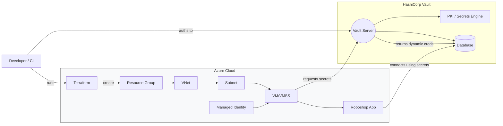

# Azure-Terraform-Hashicorpvault-Roboshop
# 🚀 Azure + Terraform + HashiCorp Vault + Roboshop

> **Infrastructure as Code** for provisioning Roboshop on Azure with secrets managed by **HashiCorp Vault** using **Terraform**.

  

---

## 🧭 Overview

This repository demonstrates a repeatable, secure, and automated way to deploy the **Roboshop** sample application on Azure using Terraform for provisioning and HashiCorp Vault for secret management. It stitches together:

* 🧱 Azure resources (VNet, subnets, VM/VMSS, managed identity, network/security)
* 🧩 Terraform modules and state management
* 🔐 HashiCorp Vault for dynamic secrets (e.g., database credentials)
* 🛠️ Bootstrapping / configuration for the Roboshop application

---

## 🗺️ Architecture (Mermaid Flowchart)



---

## 🎯 Goals

* Provide a simple, documented Terraform layout for Azure resources. ✅
* Use Vault to store and issue dynamic secrets to Roboshop. ✅
* Demonstrate secure secret consumption by VMs using Managed Identity / AppRole. ✅
* Keep code modular and reusable. ♻️

---

## 🔧 What you'll find in this repo

* `terraform/` — Terraform configuration for Azure resources and Vault integration
* `scripts/` — Provisioning and bootstrapping scripts for Roboshop
* `vault/` — Vault policies, roles, and sample scripts to create secrets
* `docs/` — Additional docs, diagrams, and notes

---

## 🧾 Prerequisites

Before you begin, ensure you have:

* 🟦 An Azure subscription
* 🧰 Terraform >= 1.4
* 🔐 HashiCorp Vault (server or HCP) — reachable from provisioned VMs
* 🔑 Azure CLI (for authentication) or Service Principal credentials
* 🐚 Bash (or WSL / macOS terminal)

---

## ⚙️ Quickstart (example)

> The commands below are a common pattern; adjust variables and paths to your environment.

1. **Login to Azure**

```bash
az login
az account set --subscription "YOUR_SUBSCRIPTION_ID"
```

2. **Initialize Terraform**

```bash
cd terraform
terraform init
```

3. **Review plan**

```bash
terraform plan -out=tfplan -var-file="secrets.tfvars"
```

4. **Apply**

```bash
terraform apply "tfplan"
```

5. **Bootstrap**

After the VMs are up, run the bootstrap script that configures Roboshop and connects to Vault:

```bash
./scripts/bootstrap-roboshop.sh <vm-ip-or-dns>
```

---

## 🔐 Vault Integration Patterns

You can use any of these patterns depending on your security posture:

* **Azure Managed Identity + Vault Azure auth** — VM authenticates to Vault using its managed identity.
* **AppRole** — Machines or apps authenticate using AppRole (good for non-Azure or CI usage).
* **Kubernetes Auth** — If Roboshop runs in AKS, use k8s auth.

Example: configure a role in `vault/` to issue database credentials dynamically.

---

## 🧪 Testing & Verification

* ✅ Validate the VM can `curl` Vault's API and fetch secrets (after auth).
* ✅ Confirm Roboshop can connect to the database using credentials issued by Vault.
* ✅ Check Terraform state and Azure portal for expected resources.

---

## 🧹 Cleanup

To destroy resources created by Terraform:

```bash
cd terraform
terraform destroy -var-file="secrets.tfvars"
```

Make sure to revoke any Vault tokens or dynamic credentials if required.

---

## 🧑‍💻 Development notes

* Keep secrets out of the repo! Use `secrets.tfvars` locally and add to `.gitignore`.
* Use remote state (Azure Storage backend) for team environments.
* Split responsibilities: networking module, compute module, vault module.

---

## ✨ Tips & Best Practices

* Rotate Vault root tokens and policies regularly 🔁
* Use Managed Identities where possible for least-privilege access ✅
* Harden VMs and use NSGs to restrict access 🔒

---

## 🧾 Example Vault policy (preview)

```hcl
# vault/policies/roboshop.hcl
path "database/creds/roboshop-role" {
  capabilities = ["read"]
}
```

---

## 📦 Contributors

Thanks to all contributors! Feel free to open issues or PRs. 🤝

---


## 🙋‍♀️ Need help?

Open an issue in this repo or DM the maintainer. Happy provisioning! 🚀✨
